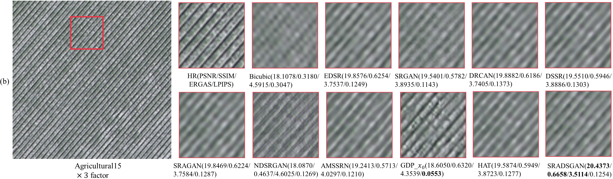

# **SRADSGAN**
**Single Remote Sensing Image Super-Resolution via a Generative Adversarial Network With Stratified Dense Sampling and Chain Training**

  - Fanen Meng, Sensen Wu, Yadong Li, Zhe Zhang, Tian Feng, Renyi Liu, Zhenhong Du
  - *IEEE Transactions on Geoscience and Remote Sensing*, vol. 62, pp. 1-22
  - https://ieeexplore.ieee.org/document/10375518

## Folder Structure

Our folder structure is as follows:

```
├── dataset (dataset used by SRADSGAN)
│   ├── sradsgan
│   │   ├── AID
│   │   ├── DOTA
│   │   ├── LoveDA
│   │   ├── RSSCN7_2800
│   │   ├── SECOND
│   │   ├── UCMerced_LandUse
├── SRADSGAN (code)
│   ├── data
│   ├── GDP_x0
│   ├── img
│   │   ├── GF2_HR.tif
│   │   ├── GF2_LR.tif
│   │   ├── Sentinel2.tif
│   ├── model
│   │   ├── amssrn.py   (amssrn model)
│   │   ├── drcan.py    (drcan model)
│   │   ├── dssr.py     (dssr model)
│   │   ├── edsr.py     (edsr model)
│   │   ├── hat.py      (hat model)
│   │   ├── ndsrgan.py  (ndsrgan model)
│   │   ├── sradsgan.py (sradsgan model)
│   │   ├── sragan.py   (sragan model)
│   │   ├── srgan.py    (srgan model)
│   ├── utils
│   ├── main_amssrn.py
│   ├── main_drcan.py
│   ├── main_dssr.py
│   ├── main_edsr.py
│   ├── main_hat.py
│   ├── main_ndsrgan.py
│   ├── main_sradsgan.py
│   ├── main_sragan.py
│   ├── main_srgan.py
│   ├── Scene_classification_mfe.py (scene classification)
```

## Introduction

- SRADSGAN (traditional generative model architecture)

  - Contains nine super-resolution models: ['EDSR', 'SRGAN', 'DRCAN', 'DSSR', 'SRAGAN', 'NDSRGAN', 'AMSSRN', 'HAT', '**SRADSGAN**']
  - GDP_x0 (diffusion model architecture): This project is based on [[sr3]](https://github.com/Janspiry/Image-Super-Resolution-via-Iterative-Refinement) and [[GDP](https://github.com/Fayeben/GenerativeDiffusionPrior)]
  - Scene_classification_mfe.py: Scene classification experiments for super-resolution results


## Environment Installation

The HAT model uses python 3.8, pytorch 1.9, tensorflow-gpu 2.1.0, and the environment of other models is in requirements.txt

```bash
pip install -r requirements.txt
```

## Dataset Preparation

We used six datasets to train our model. After secondary processing, we obtained a total of about 35,000 images of 216*216 size.  

- Train
  
  - ["AID", "DOTA", "LoveDA", "RSSCN7_2800", "SECOND"]
  
- Test
  
- ["UCMerced_LandUse"]
  
- Link:   https://drive.google.com/drive/folders/1e4VRUgFL4bDRfrb0CS6-Y9f7bTZhBqiV?usp=sharing   or  

  ​            https://pan.baidu.com/s/1cXkKu-CI6Q8EF_7Kbfxodg?pwd=w5t8   提取码：w5t8

## Train & Evaluate
1. Prepare environment, datasets and code.
2. Run training / evaluation code. The code is for training on 1 GPU.

```bash
# sradsgan
cd SRADSGAN
python main_sradsgan.py
---------------------------------------------------------------
net.train()                       # train
net.mfeNew_validate()             # test
net.mfeNew_validateByClass()      # classes test
net.mfe_test_single()             # infer
---------------------------------------------------------------
# GDP_x0
cd GDP_x0
python sr_mfe.py -p train -c config/gdp_train_27_216.json   # train
python sr_mfe.py -p val -c config/gdp_test_27_216.json      # test
python sr_mfe.py -p val -c config/gdp_GF2_x3.json           # infer

```

## Results

### 1. Comparisons With The State-of-the-Art Methods





Fig. 5. Visualization of different methods on UC Merced dataset. From (a) to (e) are x2, x3, x4, x8 and x9 SR results, respectively.

### 2. Super-Resolution on Other Multispectral Images


Fig. 8. 3-time super-resolution results of different methods on GaoFen-2 remote sensing image.


Fig. 9. 9-time super-resolution results on Sentinel-2 remote sensing image without downsampling.

## Citation

If our code helps your research or work, please consider citing our paper. 

F. Meng et al., "Single Remote Sensing Image Super-Resolution via a Generative Adversarial Network With Stratified Dense Sampling and Chain Training," in IEEE Transactions on Geoscience and Remote Sensing, vol. 62, pp. 1-22, 2024, Art no. 5400822, doi: 10.1109/TGRS.2023.3344112.
